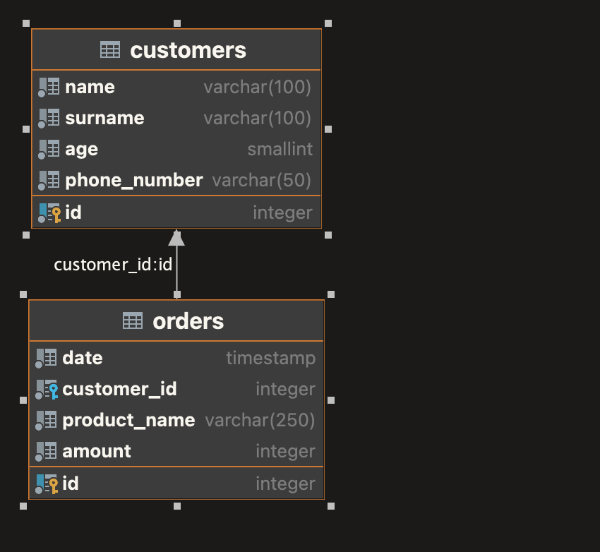

## Задание "Задача Две таблицы"

### Описание
Для того, чтобы разобраться со сложными запросами, давайте создадим две связанные таблицы и напишем для них скрипты запросов.

1. Напишите скрипт создания таблицы со следующими параметрами:
- название таблицы - `CUSTOMERS`
- содержит в себе 5 столбцов - `id`, `name`, `surname`, `age`, `phone_number`
- первичным ключом будет поле `id`, который инкрементируется каждый раз, при создании пользователя

2. Напишите скрипт создания таблицы со следующими параметрами:
- название таблицы - `ORDERS`
- содержит в себе 4 столбца - `id`, `date`, `customer_id`,`product_name`, `amount`
- первичным ключом будет поле `id`, который инкрементируется каждый раз, при создании заказа
- внешним ключом на поле `id` таблицы пользователей будет `customer_id`

3. Напишите скрипт, который будет возвращать из таблиц поля `product_name` для пользователей с именем `alexey` независимо от регистра ввода имени.

Итого у вас должно быть три файла-скрипта с расширением sql. Написанные скрипты выложите в отдельный репозиторий на гитхабе, и прикрепите ссылку на него в домашнем задании.

## Решение

Для проверки можно воспользоваться [doker-compose](./docker/docker-compose.yaml) с уже настроенной базой данных

Список скриптов для решения
- [customers_table.sql](./customers_table.sql) - таблица с покупателями
- [orders_table.sql](./orders_table.sql) - таблица с заказами
- [data](./data.sql) - скрипт с данными для заполнения
- [select_customers_from_orders.sql](./select_customers_from_orders.sql) - выборка всех заказов где покупатель 
  `alexey` независимо от регистра ввода имени.

## Схема

